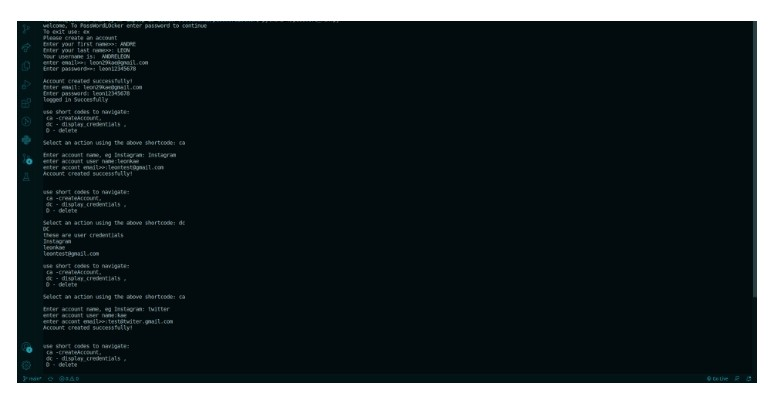

# PassWord LOCKER 
# Author
Andre Leon Kaeulana
# Description

This project is designed to hold multiple user accounts and their passwords as desired by the user.  

# Setup and Usage

above is the running instance on the terminal

# Technologies Used 
* python
  
# User Stories
* As a user, I want to create a password locker account with my details, a login username and password.
* As a user, I want to store my already existing account credentials in the application. Assuming I already have a twitter account, I want to store my already existing twitter username and password in the application.
* As a user, I want to create new account credentials in the application. For example, if I have not yet signed up for Instagram, I would want to create a credentials account for Instagram in the application and the application generates a password for me to use when I sign up for Instagram.
* As a user, I want to have the option of putting in a password that I want to use for the new credential account. For example, when creating my Instagram credential account, I want to have an option of putting in the password I want to use instead of having the application generate a password for me.
* As a user, I also want to view my various account credentials and their passwords in the application.
* As a user, I want to delete a credentials account that I no longer need in the application

the app fullfils all these user stories.

# Copyright and License

Copyright 2022 ANDRE LEON KAEULANA

Permission is hereby granted, free of charge, to any person obtaining a copy of this software and associated documentation files (the "Software"), to deal in the Software without restriction, including without limitation the rights to use, copy, modify, merge, publish, distribute, sublicense, and/or sell copies of the Software, and to permit persons to whom the Software is furnished to do so, subject to the following conditions:

The above copyright notice and this permission notice shall be included in all copies or substantial portions of the Software.

THE SOFTWARE IS PROVIDED "AS IS", WITHOUT WARRANTY OF ANY KIND, EXPRESS OR IMPLIED, INCLUDING BUT NOT LIMITED TO THE WARRANTIES OF MERCHANTABILITY, FITNESS FOR A PARTICULAR PURPOSE AND NONINFRINGEMENT. IN NO EVENT SHALL THE AUTHORS OR COPYRIGHT HOLDERS BE LIABLE FOR ANY CLAIM, DAMAGES OR OTHER LIABILITY, WHETHER IN AN ACTION OF CONTRACT, TORT OR OTHERWISE, ARISING FROM, OUT OF OR IN CONNECTION WITH THE SOFTWARE OR THE USE OR OTHER DEALINGS IN THE SOFTWARE.